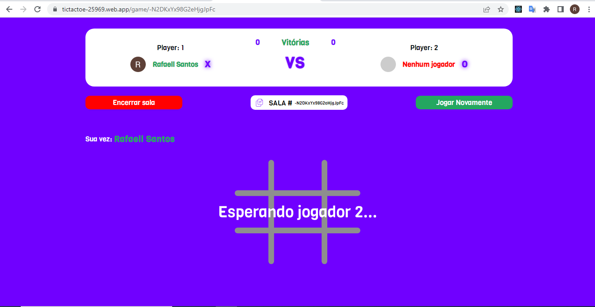

# `TicTacToe in React and Firebase`

<p align="center">
  
</p>

<p>
  
</p>

<h1 align="center">
  
</h1>

<br>

## 🧪 Tecnologias

Esse projeto foi desenvolvido com as seguintes tecnologias:

- [React](https://reactjs.org)
- [Firebase](https://firebase.google.com/)
- [TypeScript](https://www.typescriptlang.org/)

## 🚀 Caso queira fazer uma ajutes, siga esse passo a passo

Clone o projeto e acesse a pasta do mesmo.

```bash
$ git clone https://github.com/Rafael-Santos-DV/ticTacToeInReact.git
$ cd ticTacToeInReact
```

Para iniciá-lo, siga os passos abaixo:

```bash
# Instalar as dependências
$ npm install

# Iniciar o projeto
$ npm start
```

O app estará disponível no seu browser pelo endereço http://localhost:3000.

Lembrando que será necessário criar uma conta no [Firebase](https://firebase.google.com/) e um projeto para disponibilizar um Realtime Database.

Caso queira dar aquela jogada, esse aqui é o link do projeto no ar
[TicTacToe](https://tictactoe-25969.web.app/)
